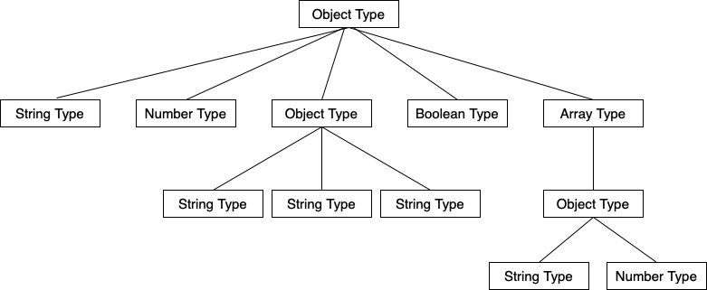

# J-String
J-String is a library written in Java that makes it easy for you to generate a JSON string from java class type for the test.

# How to work
To generate JSON string , Call `JsonGenerator.generate()` method with a Java Class Type want to generate. 

```java
public interface JsonGenerator {
    <T> String generate(Class<T> type);
}
```

When given a type, J-String generates the tree consist of `JsonFieldDefinition`.

suppose that there are the below types
```java
class Member{
  private String name;
  private int age;
  private Address address;
  private boolean gender;
  private List<Belonging> belongings;
}
```
```java
class Address{
  private String state;
  private String city;
  private String street;
}
```
```java
class Belonging{
  private String name;
  private int count;
}
```

create the below tree.


The JSON string is generated by based above tress
```json
{
  "name": "String",
  "age": 1,
  "address": {
    "state": "String",
    "city": "String",
    "street": "String"
  },
  "gender": true,
  "belongings": [
    {
      "name": "String",
      "count": 1
    }
  ]
}
```

J-String can generate JSON from classes composed of the following types:
* **Number**
  - `byte`, `Byte`
  - `short`, `Short`
  - `int`, `Integer`
  - `long`, `Long`
  - `float`, `Float`
  - `double`, `Double`
* `String`
* `Boolean`
* `Object`
  * The `ClassLoader` of object type is must be the `AppClassLoader`.
* **Array**
  - `List<T>`
  - `Set<T>`
* `Enum`


# Sample
```java
class IntegrationTest{
  private String name;
  private Integer age;
  private boolean gender;
  private ObjectType object;
  private List<List<ObjectType>> array;
}
```
```java
class ObjectType{
  private String value;
}
```
```java
List<ValueGenerator> generators = new ArrayList<>();
generators.add(new StringGenerator());
generators.add(new NumberGenerator());
generators.add(new BooleanGenerator());

JsonGenerator generator = new StandardJsonGenerator(generators);

String json = generator.generateFieldsOfType(IntegrationTest.class);
```

```json
{
  "name":"String",
  "age":1,
  "gender":true,
  "object":{
    "value":"String"
  },
  "array":[
    [
      {
        "value":"String"
      }
    ]
  ]
}
```

# To Do
* support various type
  - DateTime Types
  - Enum Type
* generate a custom value

